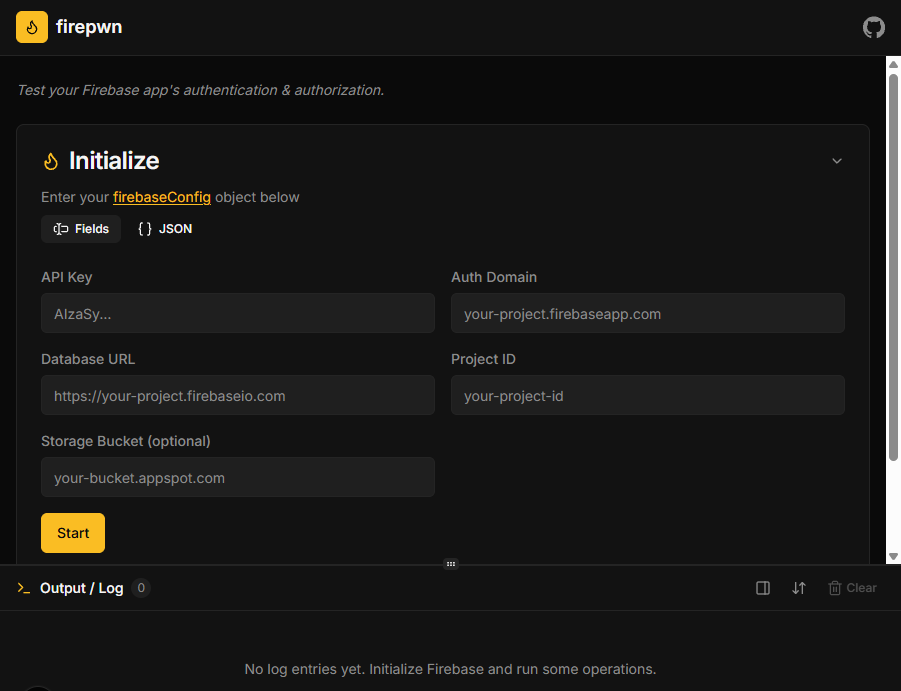
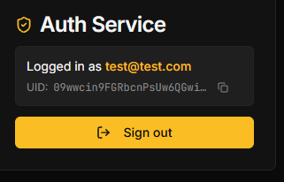
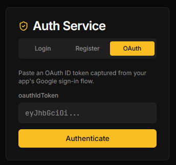
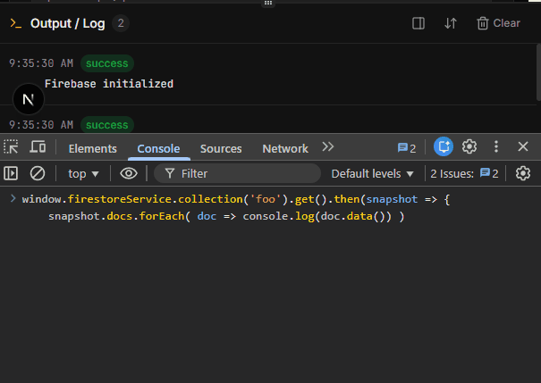

# firepwn

A tool for testing Firebase Security Rules by simulating real client SDK behavior. Unlike most Firebase pentest scripts that rely on the [REST API](https://firebase.google.com/docs/reference/rest/database), firepwn uses the actual Firebase Client SDK to test both **authentication** and **authorization** across multiple Google services.


## Features

### Firebase Initialization

Configure a target project by entering its `firebaseConfig` values (`apiKey`, `authDomain`, `databaseURL`, `projectId`, `storageBucket`). Supports both individual form fields and pasting a raw JSON/JS config object.



### Authentication

Supports multiple [Firebase Authentication](https://firebase.google.com/products/auth) methods:

- **Email/Password** - sign in with existing credentials or register a new account



- **Google OAuth** - paste an `oauthIdToken` captured from the target app's sign-in flow (e.g. from browser DevTools) to assume a Google session



- **MFA (SMS)** - complete multi-factor authentication challenges with SMS verification codes


### Firestore Database

Full CRUD operations on Firestore:

- **Get** - with document limit, sort order, and query filters (`==`, `<`, `<=`, `>`, `>=`, `array-contains`, `in`)
- **Set** - create documents or overwrite existing ones (with optional merge mode)
- **Update** - modify specific fields in existing documents
- **Delete** - remove documents


Supports nested collections/subcollections.

### Cloud Storage

Interact with Firebase Storage buckets:

- **List** files and directories
- **Upload** / **Download** files
- **Delete** files
- **Get metadata** for stored objects

### Cloud Functions

Invoke [callable Cloud Functions](https://firebase.google.com/docs/functions/) with custom parameters to test authorization on backend logic.

### Custom Scripting

Firebase services are attached to `window` globals during initialization, so you can run custom queries directly from the browser console:

| Variable                  | Reference                                                                        |
|---------------------------|----------------------------------------------------------------------------------|
| `window.authService`      | [Auth](https://firebase.google.com/docs/reference/js/v8/firebase.auth.Auth)          |
| `window.firestoreService` | [Firestore](https://firebase.google.com/docs/reference/js/v8/firebase.firestore.Firestore) |
| `window.functionsService` | [Functions](https://firebase.google.com/docs/reference/js/v8/firebase.functions.Functions) |
| `window.storageService`   | [Storage](https://firebase.google.com/docs/reference/js/v8/firebase.storage.Storage)   |



### Output Log

All operations are logged in a real-time output panel with success/error/info indicators.

## Usage

1. Launch the tool and fill in the initialization form with the target project's `firebaseConfig`.
2. Click **Start** to bootstrap the Firebase SDKs. The rest of the UI unlocks once initialization succeeds.
3. Use the **Auth** panel to authenticate (email/password, OAuth, or MFA).
4. Run Firestore queries, Storage operations, or Cloud Function invocations from the respective panels to verify authorization controls.

## Getting Started

```bash
npm install
npm run dev
```

Then open [http://localhost:3000](http://localhost:3000).


## License

[GPL-3.0](LICENSE)
