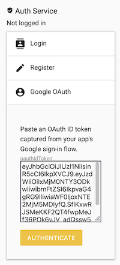

# firepwn

Most of the firebase pentest scripts on GitHub (like [this one](https://github.com/MuhammadKhizerJaved/Insecure-Firebase-Exploit) or [this one](https://github.com/nullr3x/ExpoFire)) are using the [Firebase REST API](https://firebase.google.com/docs/reference/rest/database) to test for configuration issues in Firebase apps. However:

* They might provide false-positive results in some GCP environments
* Those scripts test for authentication issues only and not authorization
* They are just checking for `allow read` permissions. If the [*Firebase Security Rules*](https://firebase.google.com/docs/rules) are set to "*deny read*" but also `allow write` then you'll probably miss some critical findings(same thing about other queries such as `delete`, `update`, etc.)

After digging in Google's documentation for a while, I managed to realize how Firebase applications work internally and the real possibilities to exploit misconfigured *Firebase Security Rules*.

This is why I created *firepwn*: a tool for testing authentication **and** authorization by utilizing multiple Google services(Firebase Auth, Firestore and Cloud Functions) using the Client SDK.

## Auth Features

Some applications use [Firebase Authentication](https://firebase.google.com/products/auth) to manage its users (a very common design). If the app that you're testing has this feature enabled, you'll be able to login to your account and perform queries/cloud invocations as an authenticated user.

### Login

### Registration

### OAuth Login

*firepwn* offers a manual OAuth flow. Sign in to the target application via OAuth provider (tested working on Google), grab the provider-issued `oauthIdToken` (for example from your browser developer tools or the app's network logs) and paste it into the OAuth login field in *firepwn*.

>**Fun fact**: Firebase applications **cannot** prevent from new users to sign-up unless the application owner disable the whole authentication service.
>
>It means that: even if you don't have credentials for a firebase application, you can always register a new account and then login using your fresh credentials.
>
>**How to close registration**: If you want to close the registration option but keep the auth service alive, you can implement a custom Cloud Function that runs as a cron job to validate that nobody registered a new account. And more importantly, configure your *Firebase Security Rules* correctly.

## Firestore DB Features

*firepwn* supports all of the useful Firestore DB methods:

* Get
* Set (=create, or overwrite if already exists)
* Delete
* Update

### Get

> **Note**: Yes, it supports nested collections :D

### Set

## Custom Scripting

It's possible to extend the abillities of *firepwn* by writing your own JavaScript code.

During initialization, I made sure that the firebase services will be stored in global variables(`window.*`) in case you'll want to write some custom code of your own to add complexity.

List of the variables:

| variable                    | Available methods/properties                                                 |   |
|-----------------------------|------------------------------------------------------------------------------|---|
| `window.authService`        | <https://firebase.google.com/docs/reference/js/firebase.auth.Auth>           |   |
| `window.firestoreService`   | <https://firebase.google.com/docs/reference/js/firebase.firestore.Firestore> |   |
| `window.functionsService`   | <https://firebase.google.com/docs/reference/js/firebase.functions.Functions> |   |

### Example 1: Firestore service

### Example 2: Auth service

## Cloud Functions Feature

If the application's backend uses [*Google Cloud Functions*](https://firebase.google.com/docs/functions/), you can invoke those functions as well and perform tests to see if you're allowed to invoke any high privileged methods.

## Notes

Couple of notes:

* In order to test the Cloud Functions feature you'll have to either:
  * Enable CORS in your firebase app
  * Alternatively, launch your Chrome with a `--disable-web-security` flag to override CORS errors
* Sorry for my poor front-end syntax/DOM manipulations...I'm more of a backend dude :P
